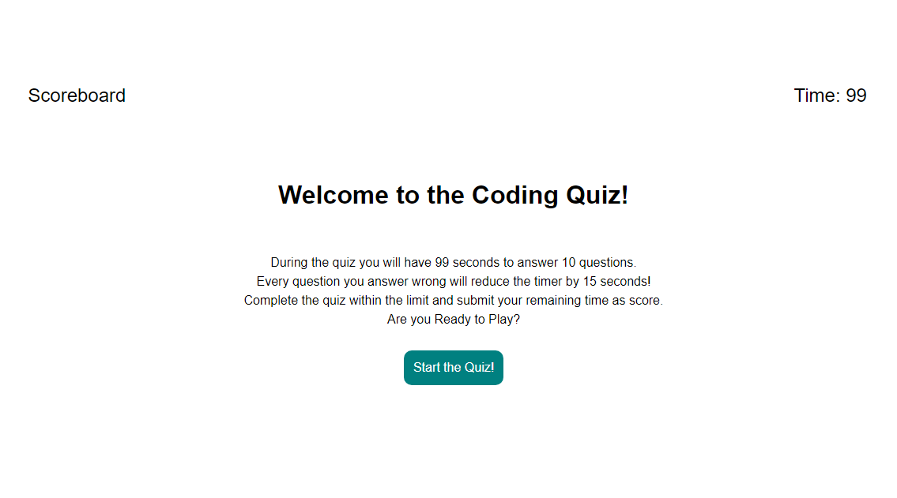

# CODE QUIZ

## Description

The goal of this project is to create a functional coding quiz that asks basic questions in regard to js, css, and html. Once the quiz starts, users will be on a timer to answer as many questions as possible. Correct answers add to their score while incorrect answers reduce their time. Once time reaches zero, the quiz is over and the user can submit their score with their initials to a scoreboard

## Installation

N/A

## Usage

The page can be found online through the following github pages link: https://mattmrob.github.io/Code_Quiz/

Users will be able to press several buttons on the page including a 'start quiz' button, which starts the quiz. Once the quiz starts, users will be on a timer of 99 seconds to answer 10 coding questions. Correct answers will progress the quiz, while incorrect answers will reduce your time by 15 seconds. If the timer runs out, the user gets a game over screen. If the user completes the quiz, they can submit their time remaining as score with three letters for initials. Your submitted score is then locally stored and appears on a clickable scoreboard. Users can also clear their scoreboard if they wish.

## Credits

n/a

## License

MIT License